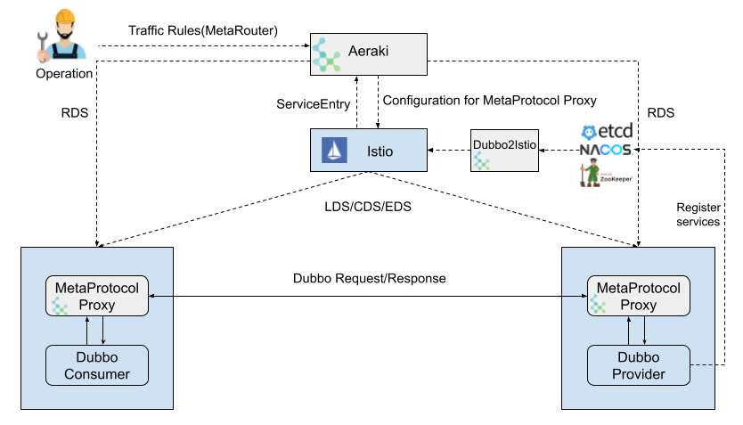

# Dubbo2Istio

Dubbo2istio 将 Dubbo 服务注册表中的 Dubbo 服务自动同步到 Istio 服务网格中，目前已经支持 ZooKeeper，Nacos 和 Etcd。

Aeraki 根据 Dubbo 服务信息和用户设置的路由规则生成数据面相关的配置，通过 Istio 下发给数据面 Envoy 中的 Dubbo proxy。

如下图所示， [Aeraki + Dubbo2istio](https://github.com/aeraki-mesh/aeraki) 可以协助您将 Dubbo 应用迁移到 Istio 服务网格中，
享用到服务网格提供的高级流量管理、可见性、安全等能力，而这些无需改动一行 Dubbo 源代码。

# Demo 应用

Aeraki 提供了一个 Dubbo Demo 应用，用于使用该 Demo 来测试 Dubbo 应用的流量控制、metrics 指标采集和权限控制等微服务治理功能。
* [Demo k8s 部署文件下载](https://github.com/aeraki-mesh/dubbo2istio/tree/master/demo)
* [Demo Dubbo 程序源码下载](https://github.com/aeraki-mesh/dubbo-envoyfilter-example)

备注：该 Demo 应用基于开源 Istio + Aeraki 运行，也可以在开通了 Dubbo 服务支持的 
[腾讯云 TCM (Tencent Cloud Mesh)](https://console.cloud.tencent.com/tke2/mesh?rid=8) 托管服务网格上运行。

Demo 安装以及 Dubbo 流量管理参见 aeraki 官网教程：https://www.aeraki.net/zh/docs/v1.0/tutorials

## 一些限制

* 多集群环境下，同一个 dubbo service 的多个 provider 实例需要部署在相同的 namesapce 中。
该限制的原因是 aeraki 采用了 dubbo interface 作为全局唯一的服务名，客户端使用该服务名作为 dns 名对服务端进行访问。
而在 Istio 中，一个服务必须隶属于一个 namespace，因此我们在进行多集群部署时，同一个 dubbo service 的多个实例不能存在于不同的 namespace 中。
如果违反了该部署限制，会导致客户端跨 namespace 访问服务器端实例时由于 mtls 证书验证失败而出错。
